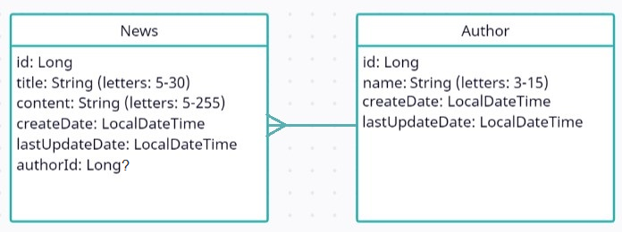

# Spring Core

### Task

#### Recommended Timeline

The recommended timeline for the whole module is 2 weeks.

#### Business requirements

- Migrate your solution prepared in **Architecture advanced** module to Spring.
- Support [CRUD](https://en.wikipedia.org/wiki/Create,_read,_update_and_delete) operations for Author as well.

#### Prerequisites

You are provided with the basic interfaces for `repository`, `service` and `controller` layers:

- `com.mjc.school.repository.model.BaseEntity`
- `com.mjc.school.repository.BaseRepository`
- `com.mjc.school.service.BaseService`
- `com.mjc.school.controller.BaseController`

Use them as base point for your solution. Do not change or delete them.

#### DataSource

Domain objects are represented by the following diagram

and have the following requirements:

- [x] All fields for News (except `authorId`) and Author are required.
- [x] _Id_ fields should be auto generated.
- [x] News _title_ field should have length from 5 to 30.
- [x] News _content_ field should have length from 5 to 255.
- [x] News and Author _createdDate_, _lastUpdatedDate_ fields should be
  in [ISO 8601](https://en.wikipedia.org/wiki/ISO_8601) format. Example: 2018-08-29T06:12:15.156. More discussion
  here: [stackoverflow: how to get iso 8601](https://stackoverflow.com/questions/3914404/how-to-get-current-moment-in-iso-8601-format-with-date-hour-and-minute)
  .
- [x] News _authorId_ field should be mapped to the author datasource.
- [x] Author _name_ field should have length from 3 to 15.

As well as in the **Architecture advanced** module data source should be generated automatically at runtime and saved in
array datasource by reading files from the `resources` folder in the repository module (database emulation).

For example: `author.txt`, `content.txt` which should contain the required data.

#### Operations

The system should expose CRUD operations for News and Author from the __main__ module in the root project:

- [x] Create News - fill only title, content, authorId and return created news.
- [x] Create Author - fill only name and return created author.
- [x] Get All News – return list of news.
- [x] Get All Authors – return list of authors.
- [x] Get News by id – return news by provided id.
- [x] Get Author by id – return author by provided id.
- [x] Update News – update only title, content, authorId by provided news id and return updated news.
- [x] Update Author – update only name by provided author id and return updated author.
- [x] Delete News – delete news by provided news id and return boolean value.
- [x] Delete Author – delete author by provided author id and return boolean value. When deleting author you could
  choose 2 options:
    - set `authorId` field for corresponding news to `null`.
    - remove corresponding news.

  > ##### Optional
  > Think of declarative way of choosing appropriate option instead of imperative way:
  >
  > _**Imperative way:**_ in `delete author` method load all news related to that author and either set their `authorId`
  > field to `null` or remove them.
  >
  > _**Declarative way:**_ use custom annotation (e.g. `@OnDelete`) with its handler (could be implemented
  > via [Aspects][1]).

As well as in the **Architecture advanced** module all returned and received data should be
like [DTO](https://en.wikipedia.org/wiki/Data_transfer_object) type.

The mapping between the `dto` and the `model (domain object)` should be done at the service layer using any library. For
example: [Mapstruct](https://mapstruct.org/), [Modelmapper](http://modelmapper.org/).

#### Validation

Validate all the input according to the rules described in [DataSource](#datasource). It can be done by directly
implementing all validations in business logic code or declaratively, e.g. via custom annotations.
> To support your custom annotations and perform validation outside of business logic code you can use
> e.g. [Aspects][1].

#### Module Main

- Use Command pattern to call operations
- Instead of direct call module-web from module-main organize communication between module-web and module-main by custom
  annotations @CommandHandler, @CommandBody and @CommandParam placed in controllers

#### Testing

- [x] Cover service layer with JUnit tests.

#### General requirements:

1. Code should be clean and should not contain any “developer-purpose” constructions.
2. App should be designed and written with respect to OOD and SOLID principles.
3. Clear layered structure should be used with responsibilities of each application layer defined.
4. All business logic should be written in the module-service: mapping `model` to `dto` and vice versa, validation, etc.
5. All the news and author data should be generated automatically in the module-repository with the amount of 20 and
   stored in array (database emulation) when the application is running. Reading default data for news and author
   generation should be from files in `resources` package, e.g. `author.txt`, `content.txt` and `news.txt`.
6. Module-web and module-service should accept and return `dto` objects.
7. Module-repository should accept and return `model` objects.
8. Convenient error/exception should be implemented: all errors should be meaningful. Errors should
   contain `errorMessage` and `errorCode`, where `errorCode` is your custom code.
9. Application should be tested and pass all tests suites.

#### Application requirements:

1. Java 17 should be used.
2. Gradle. Multi-module project. Spring.
3. Application packages root: `com.mjc.school`.
4. Java Code Convention is mandatory.

#### Our solution review:
If you have finished task and would like to see the original solution of it written by our experts, write in #stage-3 channel about it. Access will be provided.

[1]: https://docs.spring.io/spring-framework/docs/5.3.x/reference/html/core.html#aop
